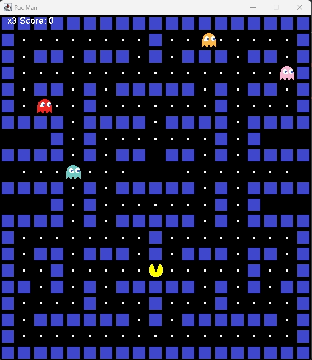

# Pac-Man Game

A classic Pac-Man-inspired desktop game built with **Java Swing**. Navigate the maze, collect food pellets, avoid four colourful ghosts, and try to achieve your highest score before losing all three lives.

## Gameplay Preview



## Features

- Classic 19 × 21 tile-based maze
- Smooth movement in four directions
- Four independently moving ghosts
- Wall and character collision detection
- Food-pellet collection with score tracking
- Three-life system and game-over state
- Direction-based Pac-Man sprites
- Lightweight Java Swing interface

## Built With

- **Java 17**
- **Java Swing and AWT**
- **Maven**

## Controls

| Key | Action |
| --- | --- |
| <kbd>↑</kbd> | Move up |
| <kbd>↓</kbd> | Move down |
| <kbd>←</kbd> | Move left |
| <kbd>→</kbd> | Move right |

> If the controls do not respond immediately, click once inside the game window to give it keyboard focus.

## Getting Started

### Prerequisites

Install the following before running the project:

- [JDK 17 or later](https://adoptium.net/)
- [Apache Maven](https://maven.apache.org/download.cgi)
- Git

Check that Java and Maven are available:

```bash
java -version
mvn -version
```

### Installation

1. Clone the repository:

   ```bash
   git clone https://github.com/Rakibul-Hashan/pacman-game.git
   ```

2. Open the project directory:

   ```bash
   cd pacman-game
   ```

3. Compile the project:

   ```bash
   mvn clean compile
   ```

4. Run the game:

   ```bash
   java -cp target/classes org.example.Main
   ```

You can also import the project into IntelliJ IDEA as a Maven project and run `Main.java`.

## How to Play

1. Use the arrow keys to guide Pac-Man through the maze.
2. Collect the white food pellets to earn **10 points** each.
3. Avoid the ghosts. Contact with a ghost costs one life and resets all characters to their starting positions.
4. The game ends when all three lives are lost.

## Project Structure

```text
pacman-game/
├── pom.xml
└── src/
    └── main/
        ├── java/
        │   └── org/example/
        │       ├── Main.java       # Creates and displays the game window
        │       └── PacMan.java     # Game loop, rendering, input and collision logic
        └── resources/
            └── images/             # Pac-Man, ghost and wall sprites
```

## Game Architecture

- `Main` creates the fixed-size Swing window and starts the game panel.
- `PacMan` manages the map, keyboard input, drawing, scoring, lives and collision detection.
- A Swing `Timer` updates the game every 50 milliseconds, producing a 20 FPS game loop.
- The maze is defined as a character-based tile map, while sprites are loaded from the resources directory.

## Contributing

Contributions are welcome. To suggest an improvement:

1. Fork the repository.
2. Create a feature branch: `git checkout -b feature/your-feature`.
3. Commit your changes: `git commit -m "Add your feature"`.
4. Push the branch: `git push origin feature/your-feature`.
5. Open a pull request.

## Possible Improvements

- Add a restart option after game over
- Detect when every pellet has been collected
- Add power pellets and frightened-ghost behaviour
- Introduce multiple levels and increasing difficulty
- Add sound effects, animations and a persistent high score

## Author

Created by [Rakibul Hashan Rabbi](https://github.com/Rakibul-Hashan).

## Disclaimer

This is an educational, non-commercial project inspired by the classic Pac-Man game. Pac-Man and related trademarks belong to their respective owners.
